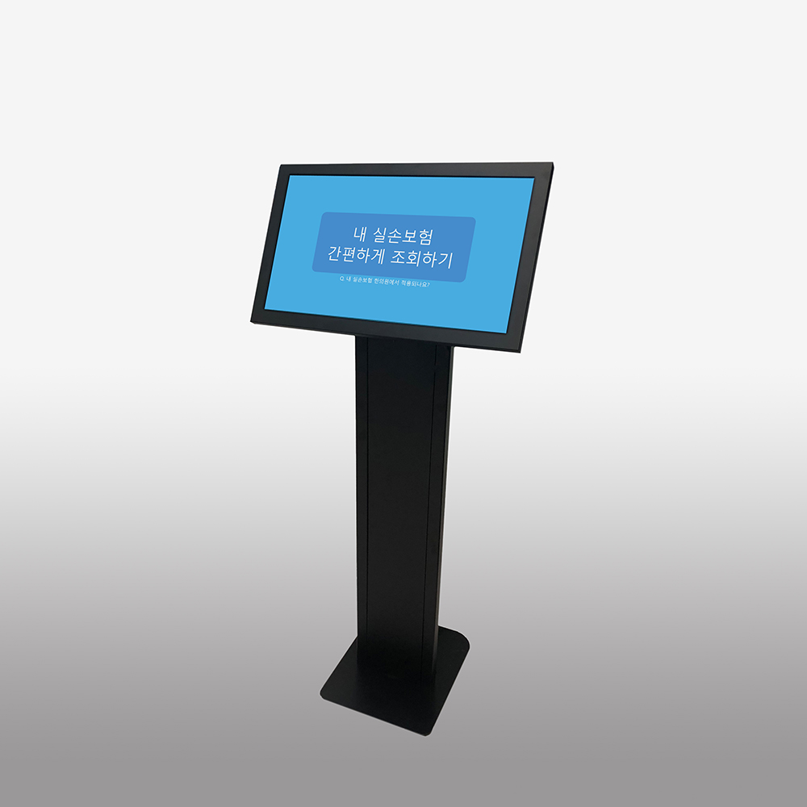
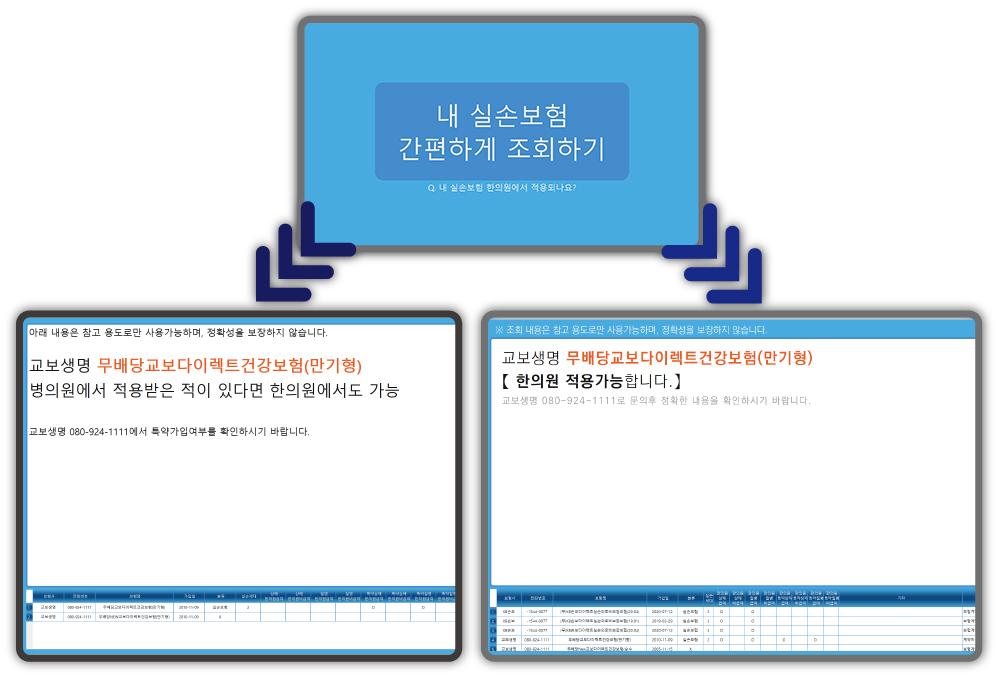
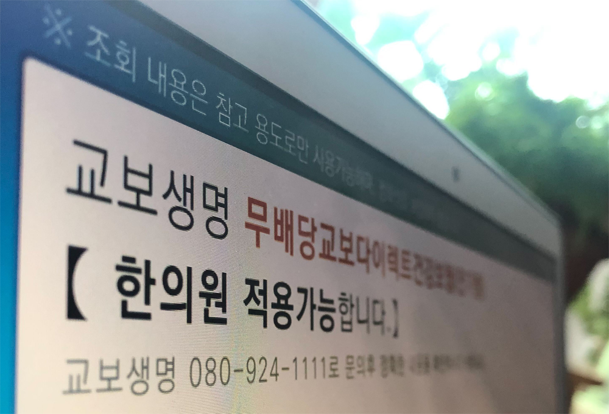

# About

<!--author-->

## ZL Insure

즐미디어에서 제공하는 키오스크 프로그램으로 환자가 간편하게 자신의 <b>실손 보험 적용 여부</b>를 확인할 수 있습니다.   
최근 <b>4세대 실손 가입여부</b> 뿐만 아니라 오래된 <b>1세대 실손에서부터 상해보험 </b>등의 가입여부를 체크하며, 더불어 급여, 비급여 의료비 보상이 <b>한의원에 적용되는지</b> 확인이 가능합니다. 
특약 사항으로 가능한 경우에는 보험회사 연락처를 통해 보험가능 여부를 확인하도록 되어 있습니다. 
차후 특약 사항까지 모두 확인 가능한 프리미엄 상품도 출시 예정에 있습니다.

{:.lead width="1000" height="867" loading="lazy"}

ZL Insure가 설치된 키오스크 
{:.figcaption}

{:.lead width="1000" height="718" loading="lazy"}
{:.lead width="1000" height="680" loading="lazy"}
>**ZL Insure** 프로그램은 설치가 매우 간단하며 초기 설치 비용이 들지 않습니다. 윈도우 기반 키오스크 혹은 터치스크린이 내장된 윈도우 기기, 노트북 등에서 모두 실행가능하며 유지보수가 쉽습니다.

## Installation
><b>설치 설명서</b> [manual] 
><b>데스크 메뉴얼</b> [desk_manual] 
><b> 프로그램 다운로드 </b>[download]
{:.lead}

[download]: https://github.com/zlmedia/ZLInsure-Production/releases
[manual]: https://docs.google.com/document/d/1nnQTHVevSUBh4iQwa1dcyCh-Nk2SCCNtbYea-iYFZMQ/edit#heading=h.ywzfnmzave1t
[desk_manual]: https://docs.google.com/document/d/1LTN_VKbKApZbLhGQdIxwHMzg_eBd9gACV7HUkjvNb2I/edit#heading=h.t5hzr55hv43j

