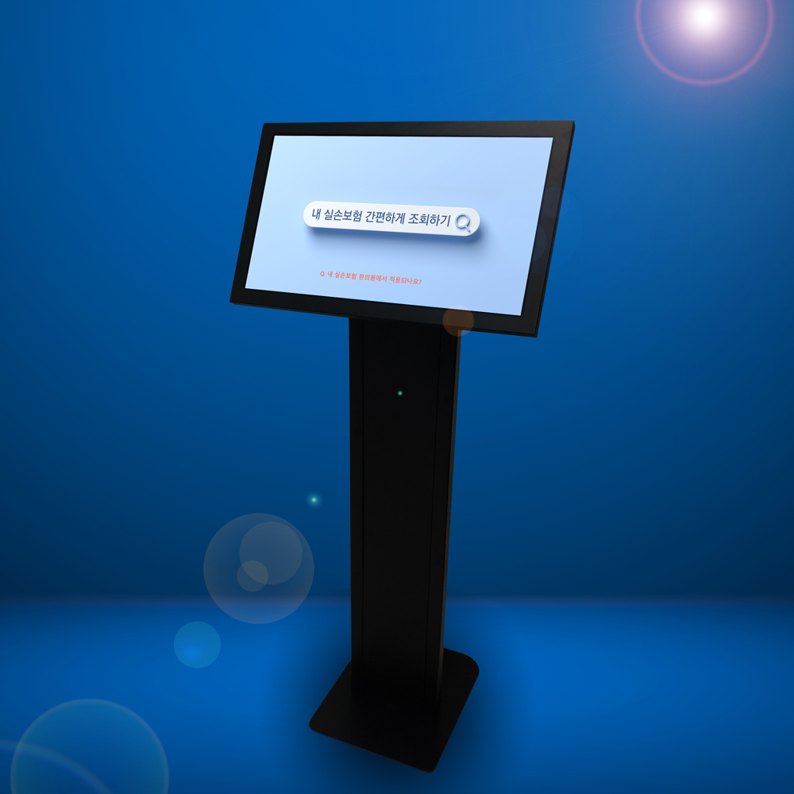

# About

<!--author-->

## ZL Insure

즐미디어에서 제공하는 키오스크 프로그램으로 환자가 간편하게 자신의 실손 보험 적용 여부를 확인할 수 있습니다.  
최근 4세대 실손 가입여부 뿐만 아니라 오래된 1세대 실손에서부터 상해보험 등의 가입여부를 체크하며, 더불어 급여, 비급여 의료비 보상이 한의원에 적용되는지 확인이 가능합니다.
특약 사항으로 가능한 경우에는 보험회사 연락처를 통해 보험가능 여부를 확인하도록 되어 있습니다.
차후 특약 사항까지 모두 확인 가능한 프리미엄 상품도 출시 예정에 있습니다.

{:.lead width="1000" height="1000" loading="lazy"}

ZL Insure가 설치된 키오스크 
{:.figcaption}

>**ZL Insure** 프로그램은 설치가 매우 간단하며 초기 설치 비용이 들지 않습니다. 윈도우 기반 키오스크 혹은 터치스크린이 내장된 윈도우 기기, 노트북 등에서 모두 실행가능하며 유지보수가 쉽습니다.

## Installation
>설치 프로그램 설치 설명서 및 다운로드 — [manual], [download].
{:.lead}

[download]: https://github.com/zlmedia/ZLInsure-Production/releases
[manual]: https://docs.google.com/document/d/1nnQTHVevSUBh4iQwa1dcyCh-Nk2SCCNtbYea-iYFZMQ/edit#heading=h.ywzfnmzave1t

